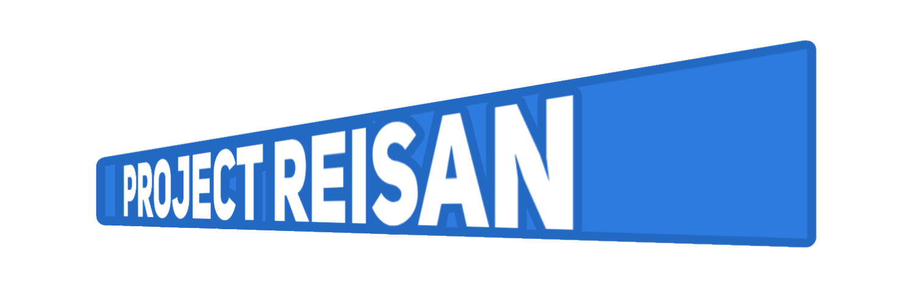

<div align="center">
  
  
  <br />

  > **Free and Open-Source 2D Game Framework with Uniformity in Mind**

  [](https://opensource.org/licenses/MIT)
  [](https://docs.microsoft.com/en-us/dotnet/csharp/)
  [](https://www.raylib.com/)
</div>

ProjectReisan is a robust, free, and open-source 2D game framework built in C#. Acting as a streamlined abstraction layer over the powerful `raylib_cs` bindings, it is designed from the ground up with **uniformity** in mind. ProjectReisan offers developers a consistent, predictable, and highly modular architecture for building 2D games without fighting the backend.

## ✨ Features

* **Raylib Powered Backend:** Leverages the performance and reliability of Raylib under the hood, wrapped in a simplified, object-oriented API (like our `Engine` and `CoreGame` classes).
* **Uniform Architecture:** Consistent API design and data structures to minimize the learning curve and maximize developer productivity.
* **C# Native:** Built on modern C# and .NET, taking full advantage of strong typing and memory management.
* **Modular Design:** Extend and replace core components easily to fit your specific game requirements.

## 🚀 Getting Started

### Prerequisites

To build and run ProjectReisan, you will need:
* [.NET SDK](https://dotnet.microsoft.com/download) (Compatible with the version targeted by `POL.csproj`)
* An IDE such as [Visual Studio](https://visualstudio.microsoft.com/), [Rider](https://www.jetbrains.com/rider/), or [Visual Studio Code](https://code.visualstudio.com/)

### Installation

1. Clone the repository to your local machine:
   ```bash
   git clone [https://github.com/Aethertenshi/ProjectReisan.git](https://github.com/Aethertenshi/ProjectReisan.git)
   ````

2.  Navigate to the project directory:
    ```bash
    cd ProjectReisan
    ```
3.  Open the solution file `POL.sln` in your preferred IDE.
4.  Build the solution to restore dependencies (including `raylib_cs`) and compile the framework.

## 📂 Project Structure

  * `/assets` - Contains default assets, templates, and placeholder files.
  * `/media` - Framework-related media, logos, and documentation images.
  * `/modules` - Core framework modules, extensions, and subsystems.
  * `POL.sln` & `POL.csproj` - The primary .NET solution and project files.

## 🤝 Contributing

Contributions are what make the open-source community such an amazing place to learn, inspire, and create. Any contributions you make are **greatly appreciated**.

1.  Fork the Project
2.  Create your Feature Branch (`git checkout -b feature/AmazingFeature`)
3.  Commit your Changes (`git commit -m 'Add some AmazingFeature'`)
4.  Push to the Branch (`git push origin feature/AmazingFeature`)
5.  Open a Pull Request

## 📄 License

Distributed under the MIT License. See `LICENSE.txt` for more information.

## 🙏 Acknowledgments

ProjectReisan stands on the shoulders of giants. A huge thank you to the following projects that make this framework possible:

  * **[Raylib](https://www.raylib.com/):** A simple and easy-to-use library to enjoy videogames programming.
  * **[Raylib-cs](https://www.google.com/search?q=https://github.com/NotNotBates/Raylib-cs):** The fantastic C\# bindings for Raylib that power the core of this framework.

-----

*Happy Game Developing\!*